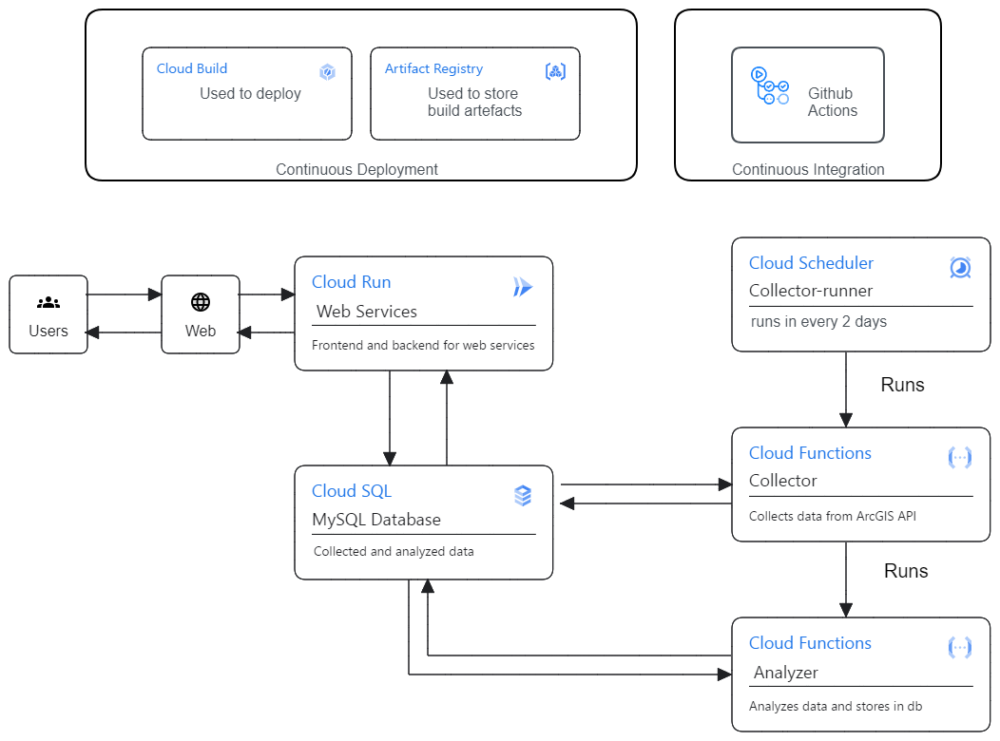
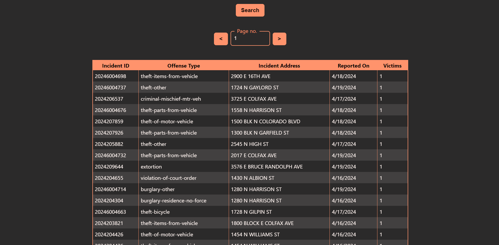
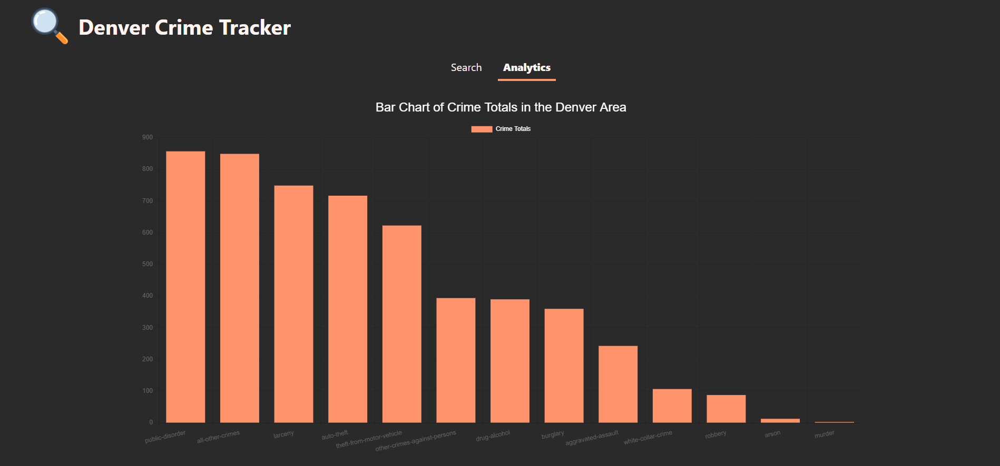

# BetaFish
Group 12: Emily Parker, Ranajit Roy, Jonathan Gorman

[](https://github.com/CSCI-5828-S24/BetaFish/actions/workflows/test_analyzer.yml) [](https://github.com/CSCI-5828-S24/BetaFish/actions/workflows/test_collector.yml) [](https://github.com/CSCI-5828-S24/BetaFish/actions/workflows/test_flask_server.yml)

## Instructions

Below are the instruction run the we app locally on an linux/ubuntu or windows platform

Install the below packages before proceeding -
1. Python3
2. Python packages: redis jsonpickle requests flask flask_cors flask-mysqldb python-dotenv
    > pip3 install --upgrade redis jsonpickle requests flask flask_cors flask-mysqldb python-dotenv
3. Node.js 20.x lts


First clone the repository

> git clone \<repo-clone-url\>

A `.env` file is necessary for the MySQL Connection. Create a `.env` in `\flask-backend\src\` and populate with the following 4 lines

```
MYSQL_HOST = host
MYSQL_USER = user
MYSQL_PASSWORD = password
MYSQL_DB = databasename
```

To build the app, run the commands below in the cloned directory -

```
npm --prefix ./react-frontend/ ci
npm --prefix ./react-frontend/ build
```

Now there are two options:
* run locally
* run with a docker image


### Run locally

> python3 flask-backend/src/flask_server.py

### Run on Docker

In order to run on a docker image, run the below commands:

```
docker build -t web-app .
docker run -p5000:5000 web-app
```

Now, the web page should be accessible on port 5000 on localhost

## Current Completed Architecture


## Updated Link to the website

https://betafish-flask-backend-3asud65paa-uc.a.run.app/ (Link may not be active)


## UI Samples
Here are some UI sample below (if the above link does not work) 




