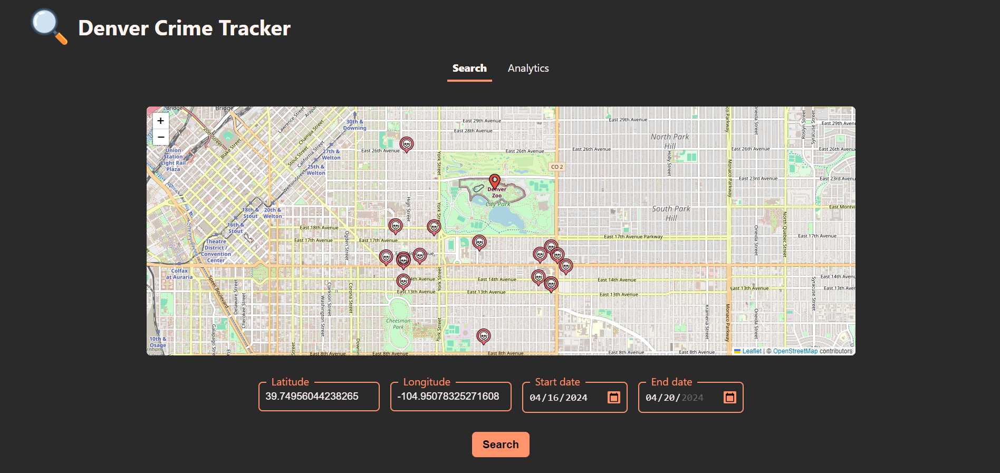

# 

### Group 12 (Betafish): Emily Parker, Ranajit Roy, Jonathan Gorman

[](https://github.com/CSCI-5828-S24/BetaFish/actions/workflows/test_analyzer.yml) [](https://github.com/CSCI-5828-S24/BetaFish/actions/workflows/test_collector.yml) [](https://github.com/CSCI-5828-S24/BetaFish/actions/workflows/test_flask_server.yml) [](https://github.com/CSCI-5828-S24/BetaFish/actions/workflows/integration-tests.yml) [](https://github.com/CSCI-5828-S24/BetaFish/actions/workflows/playwright-acceptance-tests.yml)

## Instructions

Below are the instruction run the we app locally on an linux/ubuntu or windows platform

Install the below packages before proceeding -
1. Python3
2. Node.js 20.x lts

First clone the repository

> git clone \<repo-clone-url\>

A `.env` file is necessary for the MySQL Connection. Create a `.env` in `./flask-backend`, `./cloud-data-collector` and `./cloud-data-analyzer` and populate with the following 5 lines with correct data. (leave analyzer url - used to call analyzer service from collector. Not required if called manually)

```
MYSQL_HOST=<hostname>
MYSQL_USER=<user>
MYSQL_PASSWORD=<password>
MYSQL_DB=crime_db
ANALYZER_URL=http://ip.jsontest.com
```

Run Collector: -<br>
[working directory: ./cloud-data-collector]
```
pip install -r requirements
python3 main.py
```


Run Analyzer: -<br>
[working directory: ./cloud-data-analyzer]
```
pip install -r requirements
python3 main.py
```


To build the app, run the commands below in the cloned directory -
```
npm --prefix ./react-frontend/ ci
npm --prefix ./react-frontend/ build
```

Now there are two options:
* run locally
* run with a docker image


### Run on terminal
[working directory: ./flask-backend]
```
python3 src/flask_server.py
```

Now, the web page should be accessible on port 5000 on localhost

### Monitoring
We have implemented `/metrics` endpoint with **prometheus** metrics.

Metrics:
1. Counter: `total_req`
2. Histogram: `analytics_latency`
3. Histogram: `data_latency`

## Current Completed Architecture


## Updated Link to the website

https://betafish-flask-backend-3asud65paa-uc.a.run.app/ (Link may not be active)


## UI Samples
Here are some UI sample below (if the above link does not work) 




